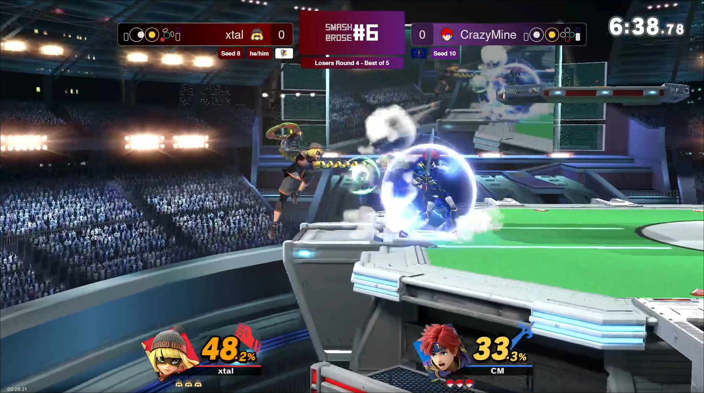

**This repository is an upload of a kind of scrappy project; the codebase is currently unorganized and quite messy, and was not initially intended for external use. Viewer discretion advised**
### Input display is modified from [periscope](https://codeberg.org/periwinkle/periscope); I take no credit for the vast majority of the code in `./libscope`, `./sysmodule`, and `./periscope`.  Please support the original project, it is very cool!
# RHIT's SSBU Layout*
**\*random project I made in my free time**
This is a layout for streaming Super Smash Bros. Ultimate in OBS.  It comes with a customizable interface and input display.

## Building
`./periscope` requires Rust. You can build it by doing
```sh
cd periscope
cargo build --release
```
The output binary will be in `./periscope/target/release`. It can be run from anywhere, though I usually move it to the project root. 

`./sysmodule`  and `./libscope` use a modded switch and requires devkitPro to build. Follow the instructions for them in the [official periscope readme](https://codeberg.org/periwinkle/periscope/) (or ask me for the file if you know me). 

Again, credit to periwinkle for creating periscope; all credit goes to her. I plan to actually fork the project at some point rather than directly including the files in this repository.

## Running
The server requires [Bun](https://bun.sh) as it's backend, so you'll need to install that beforehand. Once it's installed, you can `cd` into the project directory and run `bun server.js` to start up the main server. Once it is running, you can connect to `http://[ip or localhost]:3000` in your browser to view the layout, or add it in OBS as a browser source. To use the input display (which is optional), launch the sysmodule on the switch via Tesla overlay, then run `./periscope[.exe] -a IP` <ins>after</ins> the server is running, replacing IP with your switch's IP. 

## Usage
As said before, once everything is running you can add a browser source in obs pointing at `http://[ip or localhost]:3000` and it should show the layout. This can be done from a different computer via the host's ip. To control the layout, open `http://[ip or localhost]:3000/control.html` where things can be adjusted. 

`Update Player` updates score, user info, controller type (if input display is on), seeding, etc.
`Update Layout` updates layout color, display html, and subtitle.
